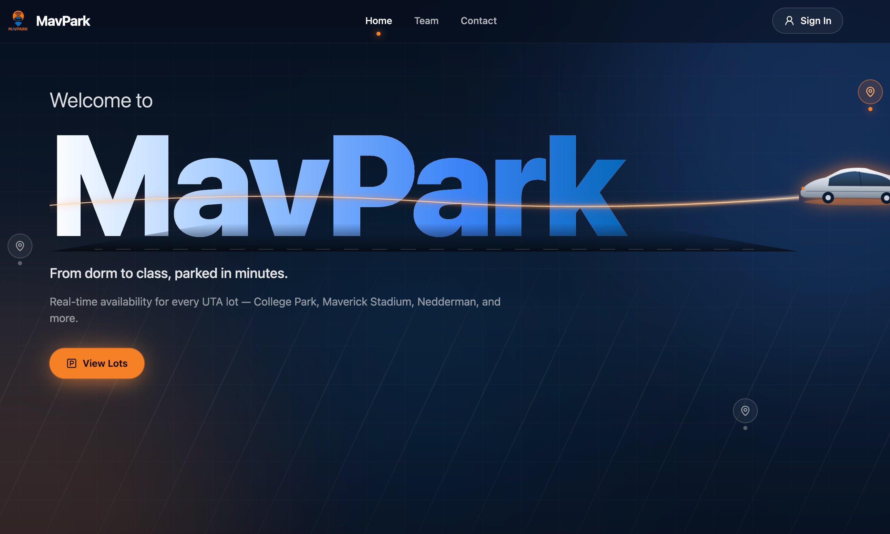
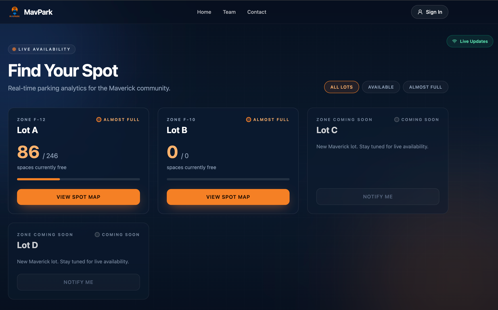
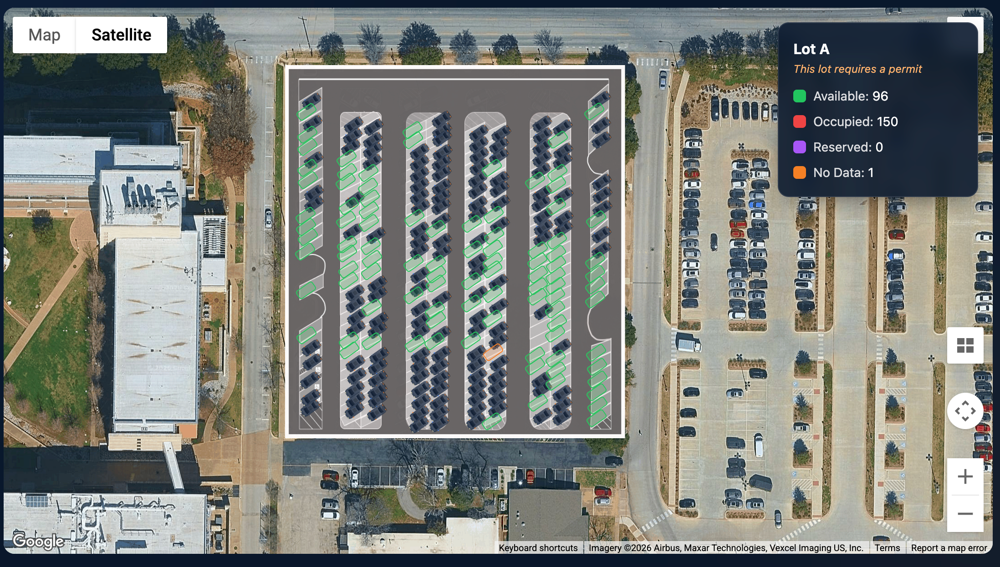
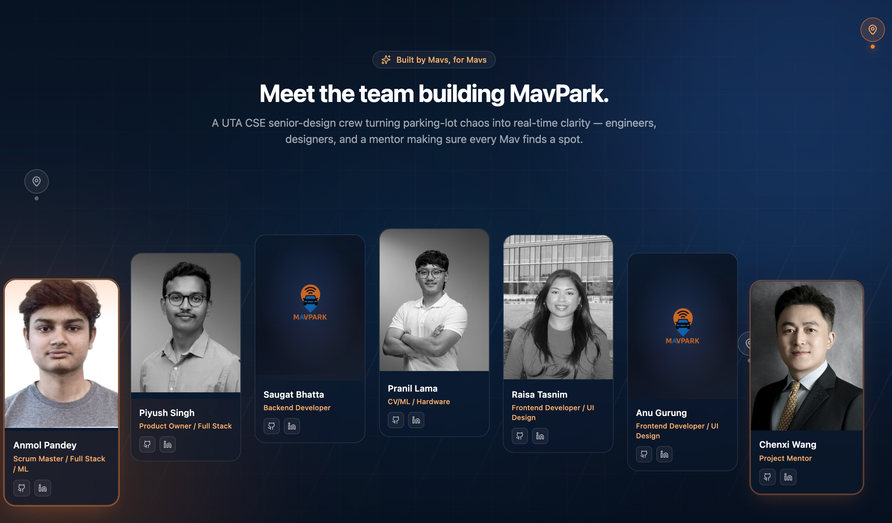

# MavPark

MavPark is a smart parking platform for UTA that combines computer vision, a real-time backend, and a modern web dashboard to show live parking availability.

## What it does

- Detects vehicles in parking lot camera feeds using YOLOv8 + SAHI
- Computes spot occupancy based on polygon-defined parking spots
- Publishes parking updates through a Spring Boot API + WebSocket
- Displays live lot status and spot maps in a React frontend
- Includes team/about and contact pages for project context

## Project screenshots






## Architecture (high level)

- **Frontend (`frontend/`)**
  - React + Vite + Tailwind
  - Uses REST + STOMP over SockJS for real-time updates
  - Main routes: Home, Dashboard, About, Contact, Calibration

- **Real-time backend (`spring-backend/`)**
  - Spring Boot (Java 17)
  - REST endpoints:
    - `GET /api/parking/status`
    - `POST /api/parking/update`
  - WebSocket endpoint: `/ws`
  - Broadcast topic: `/topic/parking`

- **Computer vision pipeline (`backend/vision/`)**
  - Python + OpenCV + Ultralytics YOLOv8 + SAHI
  - Detects vehicles and marks spots as `free`/`occupied`
  - Pushes parking updates to Spring backend
  - Can export rolling occupancy JSON for debugging/integration

- **Legacy/experimental API (`api/`)**
  - Contains a minimal `app.py` placeholder (currently empty)

## Repository structure

```text
MavPark-2/
├── frontend/         # React client (UI, maps, live updates)
├── spring-backend/   # Spring Boot REST + WebSocket backend
├── backend/          # Python CV pipeline and model utilities
├── api/              # Placeholder API module
├── docs/images/      # README screenshots
└── README.md
```

## Quick start

### 1) Frontend

```bash
cd frontend
npm install
npm run dev
```

Frontend runs on Vite dev server (typically `http://localhost:5173`).

### 2) Spring backend

```bash
cd spring-backend
mvn spring-boot:run
```

Backend runs on `http://localhost:8080`.

### 3) Vision pipeline (optional, for live detection)

```bash
cd backend
python3 -m venv venv
source venv/bin/activate
pip install -r requirements.txt
```

Then run the pipeline from the vision model directory after configuring camera/video input and ensuring `yolov8n.pt` is available.

## Environment/configuration

### Frontend env vars

Create `frontend/.env` (or `.env.local`) with:

```env
VITE_API_URL=http://localhost:8080/api
VITE_WS_URL=http://localhost:8080/ws
VITE_GOOGLE_MAPS_API_KEY=your_key_here
```

### Backend notes

- CORS is currently permissive (`*`) for development
- WebSocket uses SockJS fallback
- Spring service keeps in-memory latest parking status and broadcasts updates

## Data flow

1. CV pipeline reads camera/video frames
2. Vehicle detections are mapped to parking spot polygons
3. Aggregated status is sent to `POST /api/parking/update`
4. Spring backend stores latest state and publishes to `/topic/parking`
5. Frontend listens via WebSocket and updates UI in real time

## Tech stack

- **Frontend:** React, Vite, Tailwind CSS, React Router, STOMP/SockJS
- **Backend:** Spring Boot, WebSocket, Maven
- **Vision:** Python, OpenCV, Ultralytics YOLOv8, SAHI, Shapely

## Current status / scope

- Core real-time flow is implemented for active lot(s)
- Additional lots and calibration workflows exist and can be expanded
- Includes UI pages for live parking, spot-map drilldown, and team/project info

## Team

MavPark team includes:
- Anmol Pandey
- Piyush Singh
- Pranil Lama
- Raisa Tasnim
- Anu Gurung
- Saugat Bhatta
